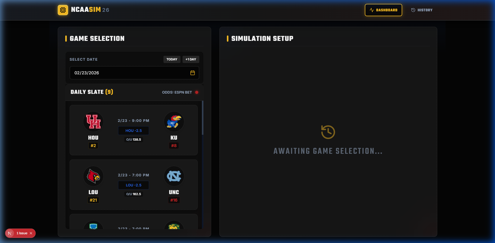
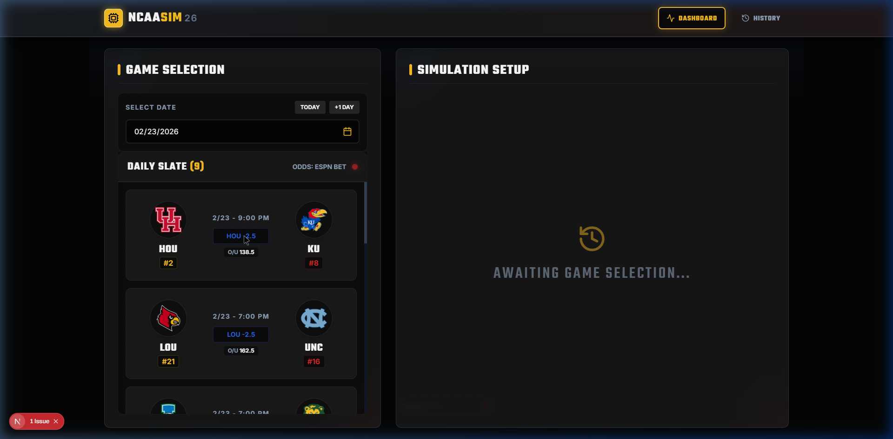
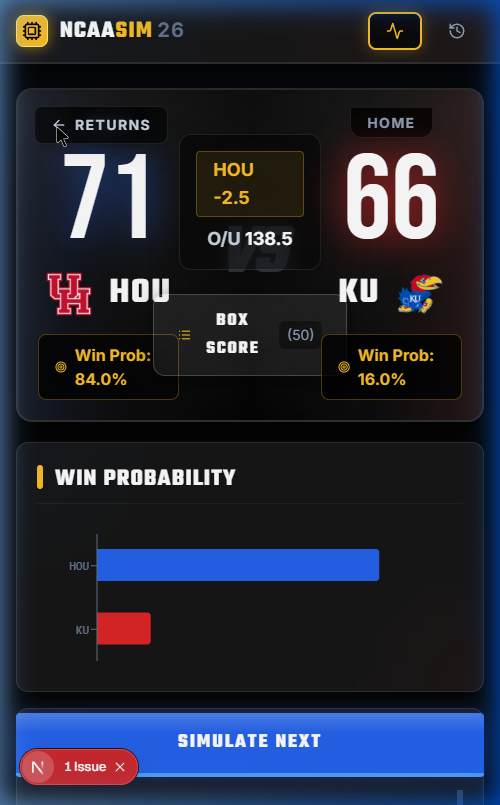

# NCAASIM26 User Guide

Welcome to the NCAA Basketball Simulator 2026! This guide will walk you through the core features of the interactive dashboard.

## 1. Accessing the Simulator

Navigate to the live application at: **[https://ncaa-sim-v2.jimmymg.workers.dev](https://ncaa-sim-v2.jimmymg.workers.dev)**

## 2. Navigating the Dashboard

The main interface is designed to emulate a premium sports video game console. 

*   **Left Panel**: This is your "Daily Slate". It displays all the games scheduled for the selected date.
*   **Top Bar**: Features the logo, navigation tabs (Dashboard and History), and overall status.
*   **Right Panel**: The main "Simulation Stage". This is where matchup details and simulation results will appear.

## 3. Selecting a Game

1.  **Choose a Date**: On the left panel, use the calendar input to select a date, or use the quick "Today" / "+1 Day" buttons.
2.  **Pick a Matchup**: Browse the list of games appearing below the date selector. Click on any game card to load it into the Simulation Setup area on the right.

## 4. Preparing the Simulation

Once a game is selected, the Simulation Setup panel (the "Jumbotron") will display the two competing teams.

*   **Team Stats**: You will see the Away team on the left and the Home team on the right, complete with abbreviations and team colors.
*   **Odds Display**: If available, the panel will display the current betting spread and Over/Under (O/U) lines. Below these numbers, dynamic Win Probabilities (ATS - Against The Spread) are calculated relative to the spread.
*   **Log View vs. Chart View**: Use the toggle buttons next to the Action button to switch between reading the textual play-by-play logs or viewing the graphical simulation flow.

## 5. Simulating the Matchup

When you are ready, press the glowing gold **"SIMULATE MATCHUP"** action button.

*   **Play-by-Play**: The screen will instantly populate with a detailed, chronological log of events that occurred during the simulated basketball game.
*   **Chart Flow**: If you switch to the Chart View, you'll see a dynamic timeline visualizing scoring runs and lead changes throughout the contest.

## Mobile Experience

The application is completely responsive. On mobile devices, the Layout naturally stacks the Daily Slate above the Simulation Setup jumbotron for an intuitive, touch-friendly scrolling experience.
